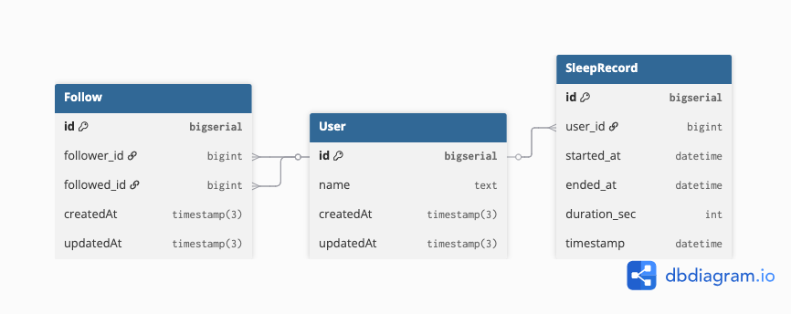

# Good Night –  System

## Ruby 3.3.5 (2024-09-03 revision ef084cc8f4)
## API (Rails 7.2.2.2 / PostgreSQL 11.5)

## How the Applications Work

The web-application is based on Ruby on Rails (RoR) Backend Framework. It's implemented through Representational State Transfer Application Program Interface (REST-API). The assumptions that has been made are as follows:



1. API-only Rails app (Rails 7+), Postgres DB.
2. No auth/registration needed because auth is simulated by passing X-User-Id header to identify the current user.
3. A user can have at most one open clock-in (sleep record without ended_at).
4. "Previous week" means the previous calendar week (Mon 00:00 → Sun 23:59:59) in Asia/Jakarta timezone. 
5. Timestamps (data created or updated date format) are stored in standard UTC and compute windows in the app timezone.
5. Sleep duration is computed in seconds and stored for fast sorting.
6. Most of the variable is styled in snake case (best practice in this programming language).
7. Each of the entity will have their own implementation (Model & Controller).
8. The sleep records can be edited thorugh PATCH instead of PUT API if it's only a single attribte (despite both are supported). 

More detailed information can be found [here](BE%20interview%20homework_v2%20(1)%20(2)%20(1).pdf) or in the source code itself (above each of the method / function).

Design Decision:
* Execute rails new good_night --api -d postgresql (for create a fresh API-only app).
* Execute bundle add rspec-rails factory_bot_rails faker database_cleaner-active_record (for testing and helper gems).
* Execute rails generate rspec:install (for initialize the RSpec).
* Prepare the Gemfile (for key gems), config/application.rb, and config/routes.rb.
* Prepare the  schema and migration in db/migration (users, follows, and sleep_records).
* Prepare the models in app/models (user, follow, sleep_record).
* Prepare the controllers and serialization in app/controllers (main application, user that include follow flow / mechanism, sleep_record that includes clock in / out action). 
* Execute rails db:create (to validate the created model / schema).
* Execute rails db:migrate (to generate the initial migration).
* Create docker-compose.yml for running through container.
* Create README.md for explaining about setup instructions, architecture explanation, and important note. 
* Create .gitignore for excluding the generated / binary files. 
* Refactor and testing.  

## Getting Started (How to Run the Program)

These instructions will get you a copy of the project up and running on your local machine for development and testing purposes.

### Prerequisites (How to set up your machine)

1. Navigate to the directory where you've cloned this repo and setting up the docker first.
2. In the directory where you've cloned this repo, move into the good_night/ folder for installing all its dependencies.

    ```bash
    bundle install
    ```

    Dependencies are all listed in `.bundle/`.

3. Run the app (if using docker can be done through docker-compose up --build). 

    ```bash
    rails server
    ```

4. The app is now running! To check that the web is actually running,
try to send a GET request to it, for instance:

    ```bash
    curl http://127.0.0.1:3000
    ```

    or open `http://localhost:3000` from your browser.

### Installing (How to check and test the program)

1. Make sure you already pull the docker images and run the container.
Both are listed in `Dockerfile` so if you followed the instructions to setup your machine above then they should already be installed and running.
2. You can run the check for running container ID with `docker ps` and for the installed images with `docker images` respectively.
3. To run the Postgre Structured Query Language (PostgreSQL) console in one command, you can use `psql`. This is useful to check the database directly.
4. For more info on what you can do with `docker`, run `docker --help`.

## Documentation

### User

* [Follow](#follow)
* [Unfollow](#unfollow)
* [Following Sleep Records](#following)

### Sleep Record

* [List](#index)
* [Create](#create)
* [Update](#update)
* [Detail](#detail)

### Other
* [Clock In](#in)
* [Clock Out](#out)

## Follow
URL: POST - `http://localhost:3000/api/users/:id/follow`

Example Response Body:

```json
{
    "ok": true
}
```

## Unfollow
URL: DELETE - `http://localhost:3000/api/users/:id/unfollow`

Example Response Body:

```json
{
    "ok": true
}
```

## Following
URL: GET - `http://localhost:3000/api/users/:id/following_sleep_records?limit=`

Example Response Body:

```json
{
   "id": 1,
    "user_id": 1,
    "user_name": "admin",
    "started_at": "2025-09-28T15:27:14.780Z",
    "ended_at": "2025-09-28T15:27:14.780Z",
    "duration_sec": 1
```

## Index
URL: GET - `http://localhost:3000/api/sleep_records`

## Create
URL: POST - `http://localhost:3000/api/sleep_records`

## Update
URL: PATCH / PUT - `http://localhost:3000/api/sleep_records/:id`

## Detail
URL: GET - `http://localhost:3000/api/sleep_records/:id`

## In
URL: POST - `http://localhost:3000/api/clock_in`

## Out
URL: POST - `http://localhost:3000/api/clock_out`

Postman's API Documentation can be found [here](triple.postman_collection.json).

## Built With

* [Ruby on Rails](https://rubyonrails.org/) - The web framework used in this backend development language
* [PostgreSQL](https://www.postgresql.org/) - Used to generate the database

## Authors

* **Bryanza Novirahman** - *Software Engineer with approximately 6 years of experience* - [LinkedIn](https://www.linkedin.com/in/bryanza-novirahman-902a94131)

## Important links
* [Docker](https://www.docker.com)